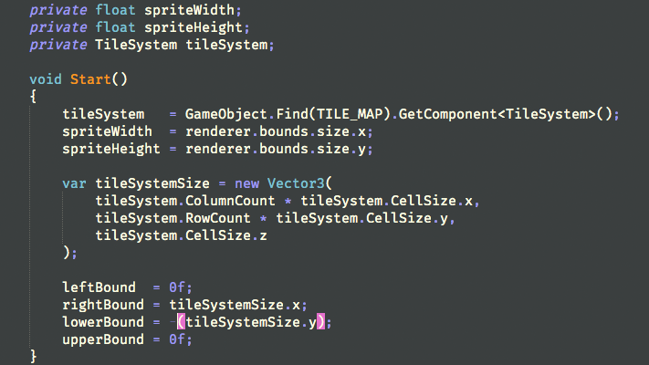
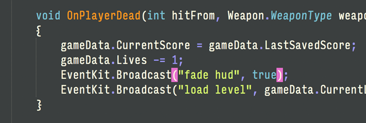

# Honey Bees: Syntax Highlighting Theme for Xamarin Studio
> A colorful yet easy-on-the-eyes color scheme for Xamarin Studio.

I developed Honey Bees with only one thing in mind — readability. I hope you find it helpful. 

## Installation

Fork or download the repo, then load the HoneyBees.json file into your installation of Xamarin Studio 
by navigating to Preferences > Syntax Highlighting, and using the Add function.

## C#, XML, HTML, CSS

Seeing as how I spend most of my time coding in C#, that is where I have concentrated my efforts — developing a readable
and attractive color scheme for C#. I'm also quite happy with the XML highlighting.

That said, if you'd like to contribute, feel free to work-up the HTML or CSS sections. I don't do much web development
these days.

## Meta

Cary Miller – [@jguarShark](https://twitter.com/jguarShark) – cary.a.miller@gmail.com

Distributed under the MIT license. See ``LICENSE`` for more information.

[https://github.com/cmilr/github-link](https://github.com/cmilr/)
