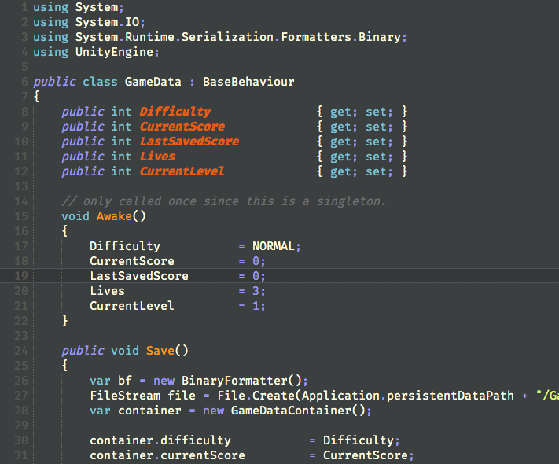

# Honey Bees: Syntax Highlighting Theme for Xamarin Studio & Microsoft Visual Studio for Mac
A colorful yet easy-on-the-eyes color scheme for Xamarin Studio. I developed Honey Bees with 
only one thing in mind — readability. I hope you find it helpful. 

## Installation

Fork or download the repo, then load the HoneyBees.json file into your installation of Xamarin Studio 
by navigating to Preferences > Syntax Highlighting, and using the Add function. That's it, you're good to go.

## Supports C#, XML, HTML, CSS

Seeing as how I spend most of my coding time in C#, that is where I have concentrated my efforts — on developing a readable
and attractive color scheme for C#. I'm also fairly happy with the XML highlighting.

That said, if you'd like to contribute, feel free to work-up the HTML or CSS sections. I don't do much web development
these days.

## Bugs
**Visual Studio for Mac** is currently running our theme a bit on the buggy side. It works, and it still looks good, but not as good as it should, because VS isn't respecting all of the tags originally supported by Xamarin. I've reported the issue to Microsoft, and am hoping for a fix. Stay tuned!

# Thanks for using XamarinStudio Dark Syntax HoneyBees!

### Contact
- Email: cmilr.soft@gmail.com

### Social Media
- Twitter: [@vintageD18](https://twitter.com/vintageD18)
- GitHub: [https://github.com/cmilr/](https://github.com/cmilr/)

### License
Distributed under the MIT license. See ``LICENSE`` for more information.
